# Obsidian Chord Sheets

Render and work with chord sheets (**chords over lyrics** or **inline chords** in brackets) in your vault. This plugin
brings UltimateGuitar-like functionality into Obsidian, featuring **chord diagrams** (guitar, ukulele, mandolin, piano),
**transposition**, and **autoscroll**. Works seamlessly in **edit / live preview**
and **reading** mode. It integrates with your **theme colors** and is **customizable** to your needs.

## Features

### ✨ Highlight Chord Symbols

Detects and highlights chord symbols in fenced code blocks marked as ```` ```chords````.

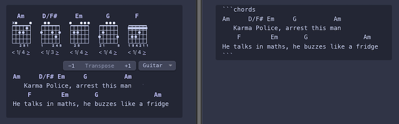


*Note:* When copy and pasting a chord sheet from a website, paste as plain text to preserve formatting (per default *⌘ +
⇧ + V* on Mac and *Ctrl + ⇧ + V* on Windows/Linux or right click ➔ *Paste as plain text*).

The plugin auto-detects chord and lyric lines. If it fails, add `%c` at the end of chord lines or `%t` for lyrics (an
idea
'borrowed' from the [Chord Lyrics](https://github.com/nevernotmove/obsidian-chordlyrics) plugin):

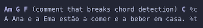

### 🎼 Chord Diagrams

Show chord diagrams for fretted instruments or piano, on hover or on top of a chord block. Provides alternative
fingerings / voicings for each chord. Diagrams are rendered locally, no API calls to an external service are required.

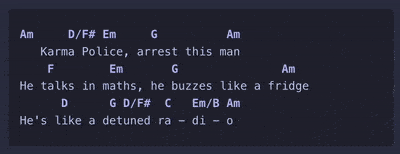

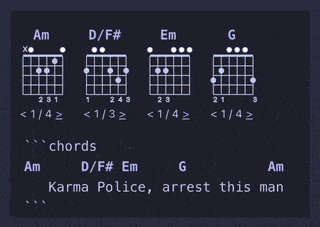

### 🎹 Piano voicings

In _edit / live preview_ mode, clicking the name of the voicing you picked writes it into the sheet as a slash chord,
either for every occurrence of the chord in the block (from the chord overview) or just for the one you hovered (from
the popup).

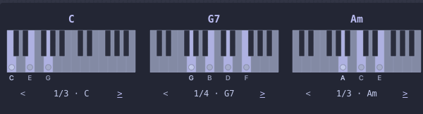

### 🎸 Choose Your Instrument

Includes chord diagrams for guitar, ukulele, mandolin, and piano. The instrument can be set globally or specified per
chord block.

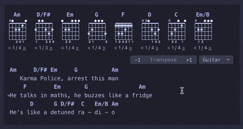

### 📝 Seamless Editing

Allows seamless editing of chords and lyrics in *live preview / edit* mode while keeping chord symbol highlighting and
chord diagram rendering active, without needing to switch the fenced block to source view. This is achieved by
implementing a CodeMirror editor extension for rendering instead of a code block post processor.

### 🔄 Transpose Songs

Transpose songs up and down with a click or an editor command. When a chord symbol gets longer or shorter (`C` → `C#`),
the spaces after it are adjusted so that the following chords stay above their syllables.

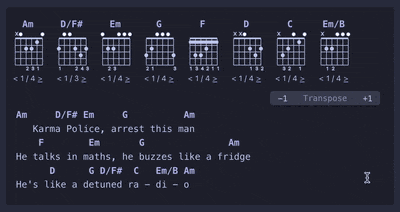

### 📜 Autoscroll

Scroll down as you play with configurable speed.

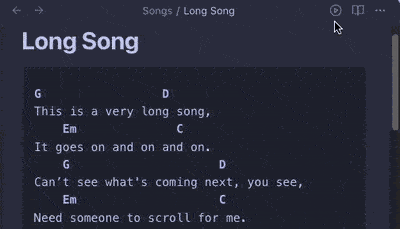

Save your preferred scroll speed for a note by adding the `autoscroll-speed` frontmatter property. Set it manually or
use the `Save current autoscroll speed` command to add it with the last used speed. The property will update
automatically as you adjust the speed.

### 🌈 Uses Theme Colors

| Minimal dark                               | Minimal light                                  | AnuPpuccin light                                     |
|--------------------------------------------|------------------------------------------------|------------------------------------------------------|
| 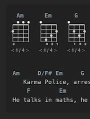 | 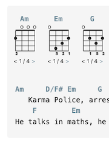 | 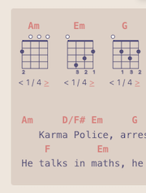 |
| 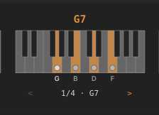 | 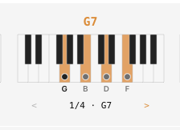 | 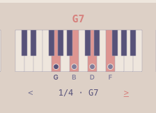 |

To customize colors and styles, use the [Style Settings](https://github.com/mgmeyers/obsidian-style-settings) plugin.


### 🔨 Custom Chord Shapes

Define your own chord shapes using brackets. On fretted instruments, use fret numbers (or `x` for muted) in brackets:
`Bbadd13[x13333]`,
`Dm6[4|x2x132]` (with capo), or `C°[x34_242_]` (with barre). For frets higher up the neck, separate with spaces or
commas: `C*[0 10 10 12 8 8]`, `C*[0,10,10,12,8,8]`.

On piano, use note names (`Cmaj7[E G B D]`) or chord degrees (`C7[3 b7 9]`) to define a voicing. A bar splits the left
and the right hand: `C7[1 5 | 3 b7 9]`

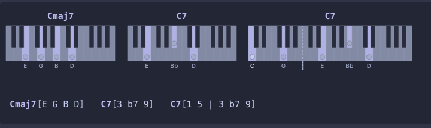

Custom fretted chord shapes and symbols are never transposed. For piano, note names are transposed along with the chord
symbol.


### ⌨️  Editor Commands

Access all features using dedicated editor commands with support for keyboard shortcuts.

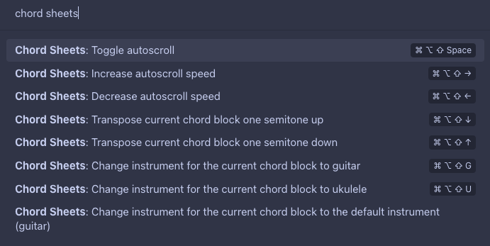

*Note*: The keyboard shortcuts in the screenshot are just for illustration. Shortcuts are empty by default and need to
be set in Obsidian settings after installing the plugin.

### 📱 Mobile Support

Works well on mobile. Bring up chord diagram popups by tapping on the chord symbols. Can be a bit fiddly in _edit / live
preview_ mode because tapping on a chord will position the caret there which brings up the keyboard. Prefer _reading_
mode on mobile.

### ⚙️ Configurability

* Turn chord or section header **highlighting** on or off
* Hide certain **UI elements** (instrument and transpose controls, chord diagrams, autoscroll button) for _edit / live
  preview_ mode, _reading_ mode, or both.
* Adjust **chord diagram size** and the **default instrument**, show or hide the **note names** in piano diagrams
* Customize the block **"language" specifier** (e.g., start a chord block with ```` ```tab````  instead of
  ```` ```chords````) and the **line markers** (e.g. `[c]` instead of `%c`)
* Integrates with [Style Settings](https://github.com/mgmeyers/obsidian-style-settings) for fine-grained customization
  of colors and styles

## Development

- Clone this repo.
- `npm i` to install dependencies
- `npm run dev` to start compilation in watch mode.

This repo contains **run / debug configurations** for JetBrains IDEs (such as WebStorm). You will need to adapt the _Run
Obsidian_ configuration to the path of your Obsidian installation and set the working directory to the path where you
cloned this repo.

To start a development and debug session with support for breakpoints etc.:

1. Run the **Run Obsidian** configuration in **debug** mode. This will start Obsidian with the
   `--remote-debugging-port=9222` parameter which enables Chrome remote debugging on port 9222.
2. Run the **Debug** configuration which attaches the IDE to Obsidian.
3. Run the **dev** configuration in **debug** mode which starts the development server.

## Manually installing the plugin

- Copy over `main.js`, `styles.css`, `manifest.json` to your vault `VaultFolder/.obsidian/plugins/chord-sheets/` and
  enable the plugin in Obsidian's settings.

## Credits

This plugin uses:

- [Vexchords](https://github.com/0xfe/vexchords) for rendering chord diagrams.
- [tonal](https://github.com/tonaljs/tonal) for parsing chord symbols, chord normalization, and transposition.
- [chords-db](https://github.com/tombatossals/chords-db) for ukulele and guitar fingerings.

## Inspiration / Alternatives

- [Scales and Chords](https://github.com/egradman/scales-chords#readme)
	- Highlights chord symbols over lyrics in fenced code blocks
	- Shows chord diagrams on click that are fetched through an external web service
- [Obsidian Chord Lyrics](https://github.com/nevernotmove/obsidian-chordlyrics#readme)
	- Highlights chord symbols over lyrics in fenced code blocks
	- Maintains chord / lyrics relationships when line wrapping, good for reading chord sheets on your phone
- [Obsidian Markdown Chords](https://github.com/dnotes/obsidian-markdown-chords)
	- Renders chords in the ChordPro-inspired [*markdown-it-chords*](https://dnotes.github.io/markdown-it-chords/)
	  (bracketed chords in lyrics) format in fenced code blocks
	- Optional rendering of chord diagrams above lyrics
	- Fingering needs to be specified explicitly as part of the chord symbol
- [Obsidian jTab](https://github.com/davfive/obsidian-jtab)
	- Renders tabs and chord diagrams in [*jTab*](https://jtab.tardate.com/) format in fenced code blocks 
